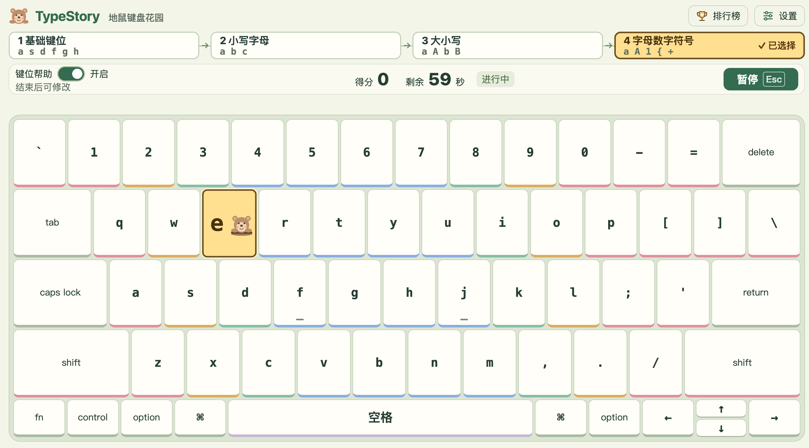

# TypeStory · 地鼠键盘花园

面向8岁键盘初学者的离线打地鼠练习。通过找字母、输入字符、打跑地鼠，熟悉键位及 C++ 常用符号。



## 打开与使用

下载或克隆整个项目，用 Chrome 打开 [index.html](index.html) 即可。无需安装依赖、启动服务器或浏览器扩展，断网也能练习。移动项目时请保持目录完整。

- 切换至 **ABC／英文输入源**，使用实体键盘答题。
- 浏览器内容区至少 **1280×700**，缩放100%；更小窗口会提示放大。
- 打开就是练习界面，选择阶段、设置“键位帮助”，点击“开始”或按 Enter。
- 阶段与帮助偏好自动保存。设置可调整 MacBook／Windows 布局、三档字符大小、音效、背景音乐和静音。

## 四个阶段

| 阶段 | 字符范围 |
| --- | --- |
| 基础键位 | `a s d f g h j k l ;` |
| 小写字母 | 全部26个小写字母 |
| 大小写 | 全部小写与大写字母 |
| 字母数字符号 | 全部大小写、数字、基础符号与 Shift 符号 |

阶段全部可选，推荐按从左到右的顺序练习，不设解锁要求。基础键位包含分号；目前不出空格、Tab 或换行题目。

“键位帮助”开启时显示完整键盘，地鼠出现在对应键上，目标键仅显示字符与地鼠，不显示手指文字；关闭时显示浅灰绿底座上的三个固定洞口，沿一排等距排列；字符牌、地鼠及洞口上下居中，地鼠从随机洞口探出，不提供局中求助。需要 Shift 时两个 Shift 同时提示“按住”，任意一侧均可。Caps Lock 与 Shift 状态跟随实际键盘事件，判定依据最终输入字符。

## 游戏与快捷键

每局60秒，一次一只地鼠。字符键松开时判定，正确加一分，错误不扣分，未答对时持续等待。开始后阶段与帮助锁定，暂停期间也不能切换；阶段使用禁用外观，当前阶段和帮助开关显示锁定标记。

| 按键 | 操作 |
| --- | --- |
| Enter | 准备／结束时开始，暂停时继续 |
| Esc | 运行时暂停 |

点击主界面的开关或按钮后，Enter／Esc仍有效；快捷键不会同时触发焦点控件的默认操作。打开排行榜、设置或名字等窗口时，快捷键只作用于窗口。


准备、暂停和结束时，练习场景覆盖50%透明的浅暖色遮罩，不放文字或按钮，不模糊背景。可随意敲实体键盘，按键高亮并播放按键音，不计分、不计错、不推进地鼠；帮助关闭时仍显示三个洞口。运行时遮罩隐藏。顶部第一行放四个阶段及最右侧的帮助开关；第二行将状态提示、得分、剩余时间及操作合并成固定高度的状态栏，操作不遮挡键盘。运行时提供“暂停 Esc”。Shift＋Enter不执行游戏操作。长按自动重复不计分，不重复触发快捷键；单独按修饰键不算错误。准确率为正确次数÷（正确次数＋错误次数）。

允许两个字符键最多40毫秒的短暂交叠；超过40毫秒，或同时按住三个及以上字符键，整组输入忽略，不加分、不计错、不影响准确率。请全部松开后再输入。Shift、Caps Lock 等修饰键不计入字符键数量；使用按下时产生的字符判定，合法大小写和符号组合不受影响。暂停、失焦、打开窗口或重新开始会取消待判定输入，命中动画期间的输入不会留到下一题。

两种场景共用650毫秒命中反馈：挥锤、受击、弹起与星星“+1”、钻回洞里。命中音效在接触与弹起时触发，背景音乐短暂降低音量；动画期间额外输入不计分也不计错，倒计时继续。错误有温和反馈。系统“减少动态效果”开启时保留表情、星星、“+1”和声音，减少大幅运动。

失焦、切换标签页或打开浮层会暂停。关闭排行榜或设置后需主动继续。浮层打开时按键不触发游戏。

状态栏在暂停时提供“继续”“重新开始”“结束”。“重新开始”直接舍弃当前局，保留阶段与帮助设置，从零分重新开始60秒练习，不覆盖历史成绩。点击“结束”直接终止，不弹确认框，本局成绩不记录。自然到时显示“本局完成”、得分与准确率；只有进入排行榜才弹出名字输入。

## 上次成绩与排行榜

数据保存在本机浏览器，不上传到服务器。四个阶段×帮助开启／关闭，共八组独立记录。

- 主界面显示**当前分组**的上次成绩，刷新后保留。仅完整60秒练习更新上次成绩；提前结束不更新，也不参与排名。旧备份中的未完成上次成绩不再展示。
- 每组排行榜保留TOP 10，只收完整60秒且得分大于0的成绩。
- 按分数降序、准确率降序排名，完全同分的已有记录优先。
- 上榜后填写1–12个字符的名字，预填上次名字；“保存”加入榜单，“跳过”不加入。上次成绩仍会保留。
- 点击“排行榜”打开浮层，可切换阶段与帮助状态查看其他榜单，不改变游戏配置。

## 设置、备份与旧版升级

设置分为“显示／声音／数据”三个页签。音效和背景音乐独立调节，总静音同时关闭两者。音频在本地通过 Web Audio 合成。

数据页可导出、导入 JSON。导入先校验，再确认替换本机的设置、排行榜及上次成绩；失败不修改数据。正在练习时需先结束本局才能导入，导出不受限制。

版本2使用 `typestory.v2` 存储键。首次升级读取版本1设置并迁移，保留旧的 `typestory.v1` 数据：旧基础键位、小写、大写分别对应新前三阶段，其余旧阶段对应第四阶段；帮助默认开启。旧版短句记录不参与新产品，也不会生成历史排名。旧版JSON可迁移设置，新版备份包含全部新数据。

清除浏览器数据、移动HTML路径、更换浏览器或用户配置可能导致进度无法读取，尤其不要将 `file://` 下的浏览器存储作为唯一备份。存储不可用时仍能练习，会显示无法自动保存的提示。

## 开发与检查

```text
TypeStory/
├── index.html             # 单界面及浮层
├── css/main.css           # 主界面、键盘、地鼠与浮层样式
├── js/
│   ├── app.js             # 输入、快捷键、渲染和浮层流程
│   ├── core.js            # 游戏状态、排名、数据校验与迁移
│   ├── keyboard.js        # 布局、字符映射和指法
│   ├── lessons.js         # 四阶段字符集合
│   └── audio.js           # 本地音效和背景音乐
├── assets/images/         # 本地 SVG 素材
├── docs/asset-sources.md   # 素材说明
└── tests/                 # 无第三方依赖的 Node.js 检查
```

所有资源使用相对路径，JS使用普通脚本；不依赖 `fetch()`、模块加载、CDN或构建流程。开发测试需要 Node.js，使用软件不需要：

```sh
node tests/core.test.js
node tests/input.test.js
node tests/app.test.js
node tests/audio.test.js
node tests/resources.test.js
node --check js/app.js
node --check js/core.js
```

测试覆盖字符范围、计时及命中阶段、八组榜单、排序、备份迁移，以及实际应用脚本在轻量DOM替身中的快捷键、浮层、状态与存储流程。DOM替身不测浏览器排版，模拟音频测试不代替实际听感。

## 发布与资源缓存

当前资源版本为 `20261011-1`。`index.html` 的 `asset-version` 元信息记录版本号，CSS、全部 JS 和页面 SVG 的资源 URL 使用相同的 `?v=20261011-1`；动态图片从元信息读取版本。版本号与本机成绩数据版本独立。

每次修改运行资源并发布时，统一更新元信息及 HTML 中全部资源 URL 的版本号，例如 `20261011-2`。不使用每次打开变化的随机值或时间戳。修改后运行测试检查版本一致及资源路径有效，再发布完整工程。

版本号能区分资源缓存，但不能强制更新已缓存的 HTML。首次部署此修复或看到旧界面时，在 Mac Chrome 按 **⌘⇧R** 强制刷新，并确认 GitHub Pages 部署已完成。资源仍使用相对路径，支持本地离线打开。

## 验证状态与使用边界

本次多键输入规则尚未通过真实 MacBook Chrome 验收；39／40／41毫秒边界、Shift组合及状态切换由自动化事件测试覆盖。此前布局的实际 Chrome 截图、三种视口下三档字号及音效听感仍未完成验收。浏览器验收尺寸为1280×700、1280×800、1440×900，需覆盖两种场景、准备／运行／暂停／结束以及全部浮层。

键盘保留指法配色，但不显示手指文字提示；网页无法判断孩子实际使用哪根手指。Fn等部分系统键可能不向网页发送事件，系统组合键保留系统行为。

建议每天练习10–15分钟，先准确再提高速度，练习间隙休息手指并看远处。
